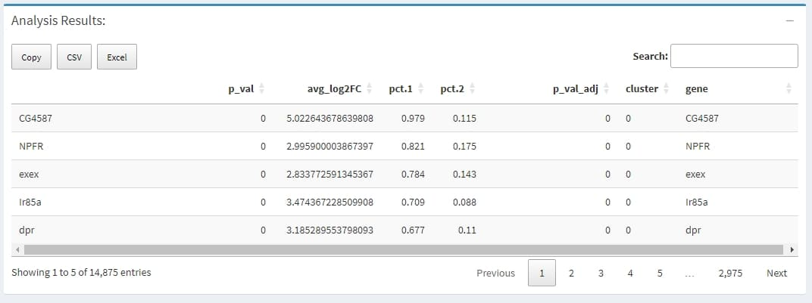
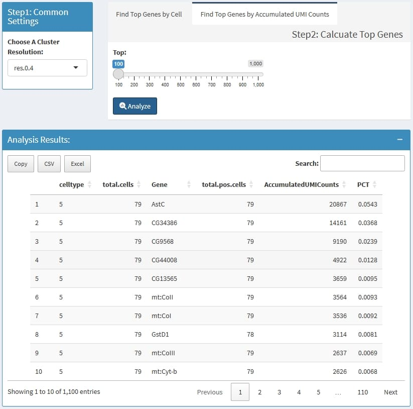
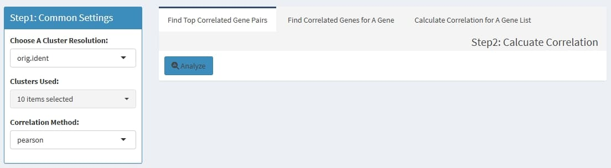
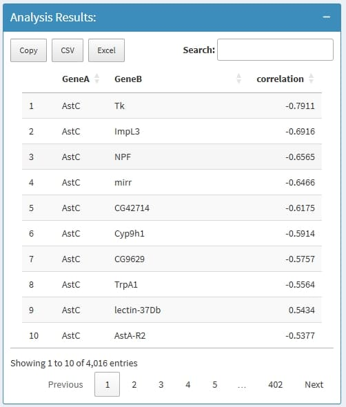

<!-- README.md is generated from README.Rmd. Please edit that file -->

```{r, include = FALSE}
knitr::opts_chunk$set(
  collapse = TRUE,
  comment = "#>",
  fig.path = "man/figures/README-",
  out.width = "100%"
)
```

```{r echo=FALSE, results="hide", message=FALSE}
library(badger)
```


# SeuratExplorer

<!-- badges: start -->
`r badge_lifecycle("stable")`
`r badge_cran_release("SeuratExplorer")`
`r badge_devel("fentouxungui/SeuratExplorer", "rossellhayes")`
`r badge_cran_download("SeuratExplorer", "grand-total")`
`r badge_code_size("fentouxungui/SeuratExplorer")`
<!-- badges: end -->

> An 'Shiny' App for Exploring scRNA-seq Data Processed in 'Seurat'

A simple, one-command package which runs an interactive dashboard capable of common visualizations for single cell RNA-seq. 'SeuratExplorer' requires a processed 'Seurat' object, which is saved as 'rds' or 'qs2' file.

## Why build this R package

> Currently, there is still no good tools for visualising the analysis results from ``Seurat``, when the bioinformatics analyst hands over the results to the user, if the user does not have any R language foundation, it is still difficult to retrieve the results and re-analysis on their own, and this R package is designed to help such users to visualize and explore the anaysis results. The only thing to do for such users is to configure R and Rstudio on their own computers, and then install ``SeuratExplorer``, without any other operations, an optional way is to upload the ``Seurat object`` file to a server which has been deployed with ``shinyserver`` and ``SeuratExplorer``.

> Essentially, what ``SeuratExplorer`` done is just to perform visual operations for command line tools from ``Seurat`` or other packages.

## Installation

Install the latest version from github - *Recommended*:

```{r eval=FALSE}
if(!require(devtools)){install.packages("devtools")}
install_github("fentouxungui/SeuratExplorer", dependencies = TRUE)
```

Or install from CRAN:

```{r eval=FALSE}
# install none-CRAN dependency
if (!require("BiocManager", quietly = TRUE)){install.packages("BiocManager")}
BiocManager::install(c("ComplexHeatmap", "MAST", "limma", "DESeq2"))
if(!require(devtools)){install.packages("devtools")}
devtools::install_github("immunogenomics/presto")

install.packages("SeuratExplorer")
```

## Run app on local
 
```{r eval=FALSE}
library(SeuratExplorer)
launchSeuratExplorer()
```

## Deploy on server

You can deploy this app on a shiny server, which allows people to view their data on a webpage by uploading the data to server.

A live demo: Upload an Rds or qs2 file, with file size no more than 5GB, to [Demo Site](http://www.nibs.ac.cn:666/SeuratExplorer/). You can download a mini demo data from [github](https://github.com/fentouxungui/SeuratExplorerServer/blob/main/inst/extdata/demo/fly/Rds-file/G101_PC20res04.rds).

```{r eval=FALSE}
# app.R
library(SeuratExplorer)
library(shiny)
library(shinydashboard)
options(SeuratExplorerVerbose = FALSE)
shinyApp(SeuratExplorer::ui, SeuratExplorer::server)
```

## Introduction

### Load data

- support ``Seurat`` object saved as ``.rds`` or ``.qs2`` file.

- support data processed by ``Seurat`` V5 and older versions. it may takes a while to update ``Seurat`` object when loading data.

```{r echo = FALSE, message=FALSE, warning=FALSE, out.width="50%"}
knitr::include_graphics("inst/extdata/www/loading-before.jpg")
knitr::include_graphics("inst/extdata/www/loading-after.jpg")
```

### Cell Metadata

- support download cell metadata in ``csv`` format, which can be used to for further analysis.

```{r  echo = FALSE, message=FALSE, warning=FALSE}
knitr::include_graphics("inst/extdata/www/cell-metadata.jpg")
```

### Dimensional Reduction Plot

- support options for **Dimension Reductions**

- support options for **Cluster Resolution**

- support **split** plots

- support adjust the height/width ratio of the plot

- support options for showing **cluster label**

- support adjust label size

- support adjust point size

- support download plot in pdf format, what you see is what you get

**Example plots:**

```{r  echo = FALSE, message=FALSE, warning=FALSE, out.width="50%"}
knitr::include_graphics("inst/extdata/www/dimplot.jpg")
```

```{r  echo = FALSE, message=FALSE, warning=FALSE, out.width="90%"}
knitr::include_graphics("inst/extdata/www/Dimplot-splited.jpg")
```

### Feature Plot

- support display multiple genes simultaneous, genes names are case-insensitive. Tips: paste multiple genes from excel

- support options for **Dimension Reductions**

- support **split** plots

- support change colors for the lowest expression and highest expression

- support adjust the height/width ratio of the plot

- support adjust point size

- support download plot in pdf format, what you see is what you get

**Example plots:**

```{r  echo = FALSE, message=FALSE, warning=FALSE, out.width="50%"}
knitr::include_graphics("inst/extdata/www/featureplot-1-with-label.jpg")
```

```{r  echo = FALSE, message=FALSE, warning=FALSE}
knitr::include_graphics("inst/extdata/www/featureplot-1.jpg")
knitr::include_graphics("inst/extdata/www/Featureplot-split.jpg")
```

### Violin Plot

- support display multiple genes simultaneous, genes names are case-insensitive. Tips: paste multiple genes from excel

- support options for **Cluster Resolution**

- support **split** plots

- support **stack** and **flip** plot, and color mapping selection.

- support adjust point size and transparency

- support adjust font size on x and y axis

- support adjust the height/width ratio of the plot

- support download plot in pdf format, what you see is what you get

**Example plots:**

```{r echo = FALSE}
knitr::include_graphics("inst/extdata/www/Vlnplot-1.jpg")
knitr::include_graphics("inst/extdata/www/Vlnplot-2.jpg")
knitr::include_graphics("inst/extdata/www/vlnplot-splited-1.jpg")
knitr::include_graphics("inst/extdata/www/vlnplot-splited-2.jpg")
```

### Dot Plot

- support display multiple genes simultaneous, genes names are case-insensitive. Tips: paste multiple genes from excel

- support options for **Cluster Resolution** and subset clusters

- support **split** plots

- support cluster clusters

- support rotate axis and flip coordinate

- support adjust point size and transparency

- support adjust font size on x and y axis

- support adjust the height/width ratio of the plot

- support download plot in pdf format, what you see is what you get

**Example plots:**

```{r echo = FALSE, out.width="70%"}
knitr::include_graphics("inst/extdata/www/Dotplot-1.jpg")
```

```{r echo = FALSE, out.width="50%"}
knitr::include_graphics("inst/extdata/www/dotplot-splited-1.jpg")
```

### Heatmap for cell level expression

- support display multiple genes simultaneous, genes names are case-insensitive. Tips: paste multiple genes from excel

- support options for **Cluster Resolution** and reorder clusters

- support adjust font size and rotation angle of cluster label, and flip coordinate

- support adjust the height of group bar

- support adjust the gap size between groups

- support adjust the font size of gene names

- support adjust the height/width ratio of the plot

- support download plot in pdf format, what you see is what you get

**Example plots:**

```{r echo = FALSE}
knitr::include_graphics("inst/extdata/www/Heatmap-1.jpg")
```

### Heatmap for group averaged expression

- support display multiple genes simultaneous, genes names are case-insensitive. Tips: paste multiple genes from excel

- support options for **Cluster Resolution** and reorder clusters

- support adjust font size and rotation angle of cluster label

- support adjust the font size of gene names

- support adjust the height/width ratio of the plot

- support download plot in pdf format, what you see is what you get

**Example plots:**

```{r echo = FALSE, out.width="50%"}
knitr::include_graphics("inst/extdata/www/averagedheatmap.png")
```

### Ridge Plot

- support display multiple genes simultaneous, genes names are case-insensitive. Tips: paste multiple genes from excel

- support options for **Cluster Resolution** and reorder clusters

- support adjust column numbers

- support stack plot and color mapping

- support adjust font size on x and y axis

- support adjust the height/width ratio of the plot

- support download plot in pdf format, what you see is what you get

**Example plots:**

```{r echo = FALSE, out.width="70%"}
knitr::include_graphics("inst/extdata/www/ridgeplot-1.jpg")
```

```{r echo = FALSE}
knitr::include_graphics("inst/extdata/www/Ridgeplot-2.jpg")
knitr::include_graphics("inst/extdata/www/Ridgeplot-3.jpg")
```

### Plot Cell Percentage

- support facet

- support adjust the height/width ratio of the plot

- support download plot in pdf format, what you see is what you get

**Example plots:**

```{r echo = FALSE, out.width="50%"}
knitr::include_graphics("inst/extdata/www/cellratio-1.jpg")
knitr::include_graphics("inst/extdata/www/cellratio-2.jpg")
```

### Find Cluster Markers and DEGs Analysis

This usually takes longer, please wait patiently.Please save the results before start a new analysis, the old results will be overwritten by the new results, the results can be downloaded as ``csv`` format.

#### Support two ways

- support find markers for all clusters

- support calculate DEGs for self-defined two groups, you can subset cells before calculate DEGs between two groups, default use all cells of two groups.

You can modify part calculation parameters before a analysis.

**Screen shots:**

```{r echo = FALSE}
knitr::include_graphics("inst/extdata/www/DEGs-1.jpg")
knitr::include_graphics("inst/extdata/www/DEGs-2.jpg")
knitr::include_graphics("inst/extdata/www/DEGs-3.jpg")
```

#### Output description

```{r echo = FALSE}

```

> [FindMarkers(object, ...)](https://satijalab.org/seurat/reference/findmarkers)
>
> A data.frame with a ranked list of putative markers as rows, and associated statistics as columns (p-values, ROC score, etc., depending on the test used (test.use)). The following columns are always present:
> 
> avg_logFC: log fold-chage of the average expression between the two groups. Positive values indicate that the gene is more highly expressed in the first group
> 
> pct.1: The percentage of cells where the gene is detected in the first group
> 
> pct.2: The percentage of cells where the gene is detected in the second group
> 
> p_val_adj: Adjusted p-value, based on bonferroni correction using all genes in the dataset

### Top Expressed Features

Highly expressed genes can reflect the main functions of cells, there two ways to do this. the first - ``Find Top Genes by Cell`` could find gene only high express in a few cells, while the second - ``Find Top Genes by Accumulated UMI counts`` is biased to find the highly expressed genes in most cells by accumulated UMI counts.

#### 1. Find Top Genes by Cell

#### How?

Step1: for each cell, find genes that has high UMI percentage, for example, if a cell has 10000 UMIs, and the ``UMI percentage cutoff`` is set to 0.01, then all genes that has more than 10000 * 0.01 = 100 UMIs is thought to be the highly expressed genes for this cell.

Step2: summary those genes for each cluster, firstly get all highly expressed genes in a cluster, some genes may has less cells, then for each gene, count cells in which this genes is highly expressed, and also calculate the mean and median UMI percentage in those highly expressed cells.


```{r echo = FALSE}
knitr::include_graphics("inst/extdata/www/Find-Top-Genes-by-Cell.jpg")
```

#### Output description

- ``celltype``: the cluster name which is define by ``Choose A Cluster Resolution``

- ``total.cells``: total cell in this cluster

- ``Gene``: this Gene is highly expressed in at least 1 cell in this cluster

- ``total.pos.cells``: how many cells express this gene

- ``total.UMI.pct``: (all UMIs of this gene)/(total UMIs of this cluster)

- ``cut.Cells``:  how many cells highly express this gene

- ``cut.pct.mean``: in those highly expressed cells, the mean expression percentage

- ``cut.pct.median``: in those highly expressed cells, the median expression percentage


#### 2. Find Top Genes by Mean UMI counts

for each cluster, calculate the ``top n`` highly expressed genes by Mean UMI counts. if a cluster has less than 3 cells, this cluster will be escaped.

```{r echo = FALSE}

```

#### Output description

- ``CellType``: the cluster name which is define by ``Choose A Cluster Resolution``

- ``total.cells``: total cell in this cluster

- ``Gene``: the ``top n`` highly expressed genes 

- ``total.pos.cells``: how many cells express this gene

- ``MeanUMICounts``: (total accumulated UMI counts) / (total cells of this cluster)

- ``PCT``:  (total accumulated UMI counts of the gene) / (total UMIs of cluster cells)

### Feature Summary

Summary interested features by cluster, such as the positive cell percentage and mean/median expression level.

```{r echo = FALSE}
knitr::include_graphics("inst/extdata/www/gene-short-summary.jpg")
```

#### Output description

- ``celltype``: the cluster name which is define by ``Choose A Cluster Resolution``

- ``TotalCells``: total cell in this cluster

- ``Gene``: the input genes 

- ``PCT``: the percentage of how many cells express this gene in this cluster

- ``Expr.mean``: the mean normalized expression in this cluster

- ``Expr.median``:  the median normalized expression in this cluster

### Feature Correlation Analysis

Can calculate the correlation value of gene pairs within cells from a cluster, support pearson & spearman methods.

#### 3 ways to do

- ``Find Top Correlated Gene Pairs``: to find top 1000 correlated gene pairs

- ``Find Correlated Genes for A Gene``: to find the most correlated genes for input genes

- ``Calculate Correlation for A Gene List``: to calculate the correlation value for each pair of the input genes

```{r echo = FALSE}

```

#### Output description

```{r echo = FALSE, out.width="40%"}

```

- ``GeneA``: the first gene in a Gene pair

- ``GeneB``:  the second gene in a Gene pair

- ``correlation``: the correlation value

if nothing return, this is because the input genes has very low expression level, very low expressed genes will be removed before analysis.

## Key related packages

- [satijalab/seurat](https://github.com/satijalab/seurat): Seurat is an R toolkit for single cell genomics, developed and maintained by the Satija Lab at NYGC.

- [Hla-Lab/SeuratExplorer](https://github.com/rwcrocker/SeuratExplorer/): An interactive R shiny application for exploring scRNAseq data processed in Seurat.

- [junjunlab/scRNAtoolVis](https://github.com/junjunlab/scRNAtoolVis): Some useful function to make your scRNA-seq plot more beautiful.

- [rstudio/shiny-server](https://github.com/rstudio/shiny-server): Shiny Server is a server program that makes Shiny applications available over the web.

## Session Info

```{r echo = FALSE}
sessionInfo()
```

