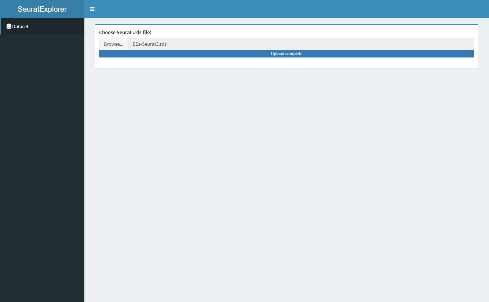
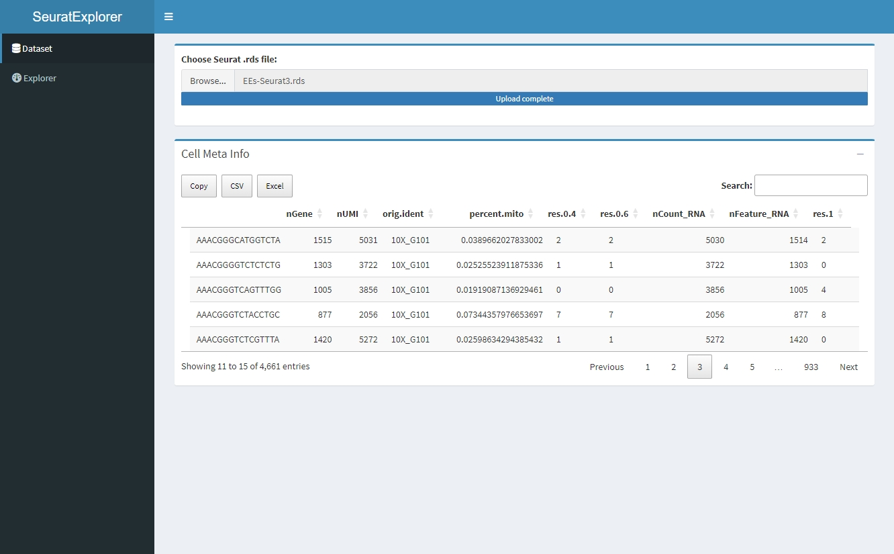
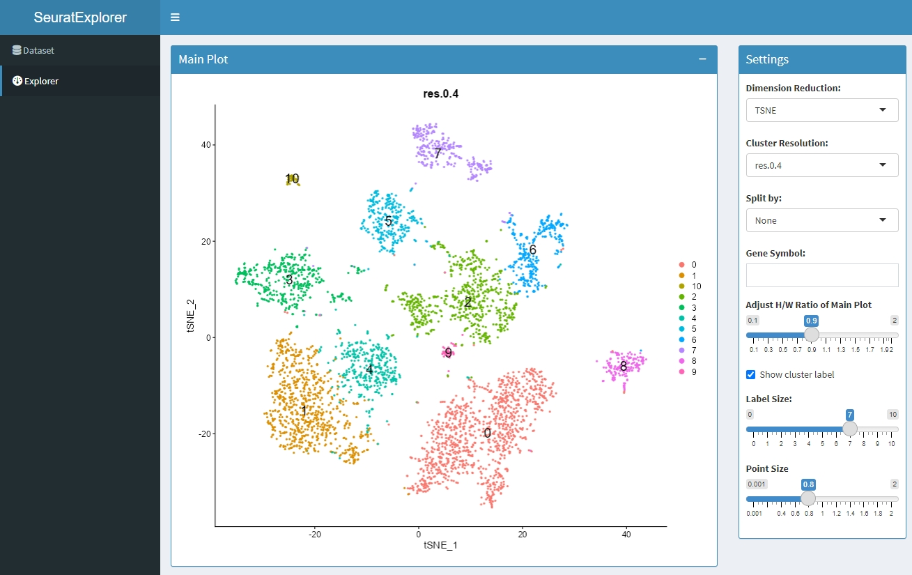
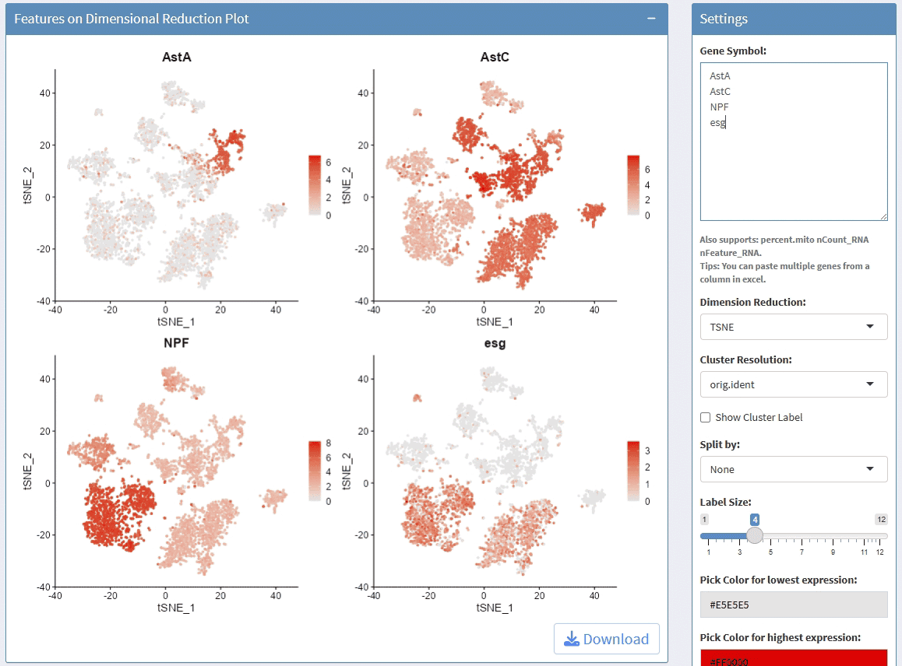

<!-- README.md is generated from README.Rmd. Please edit that file -->

# SeuratExplorer

<!-- badges: start -->

[](https://lifecycle.r-lib.org/articles/stages.html#experimental)
<!-- badges: end -->

> 此R包参考了开源程序[Hla-Lab/SeuratExplorer](https://github.com/rwcrocker/SeuratExplorer/).

> An interactive R shiny application for exploring scRNAseq data
> processed in Seurat

## Installation

You can install the development version of SeuratExplorer like so:

``` r
library(devtools)
install_github("fentouxungui/SeuratExplorer")
```

## Example

本页内容后续会更新！

``` r
library(SeuratExplorer)
```

Run App:

``` r
launchSeuratExplorer()
```

## About

### Load data



### Cell Meta



### Dimplot



### FeaturePlot


