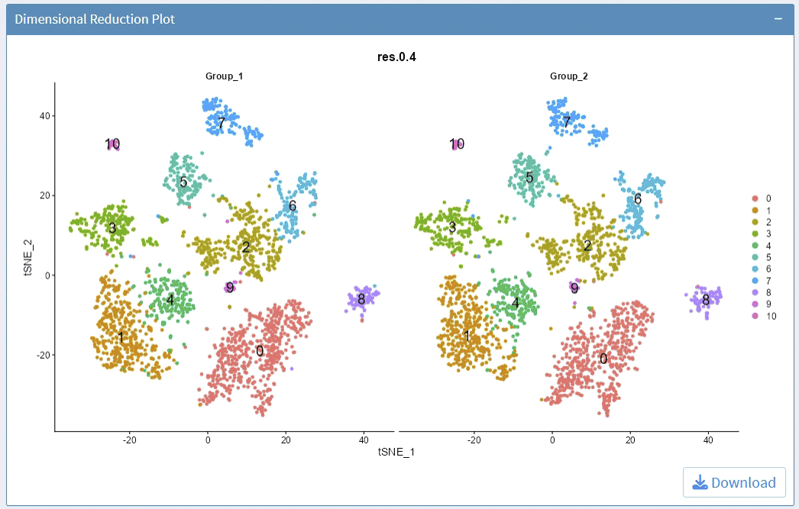
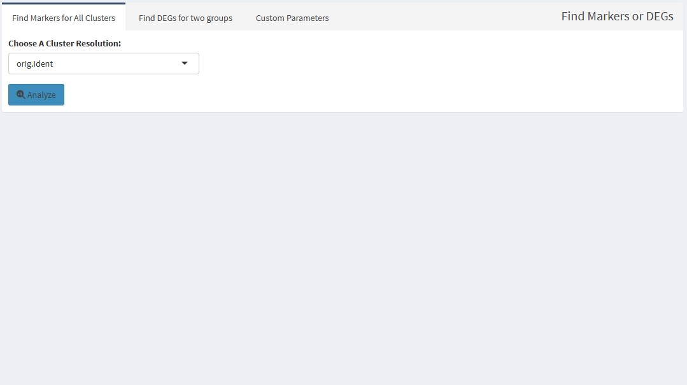
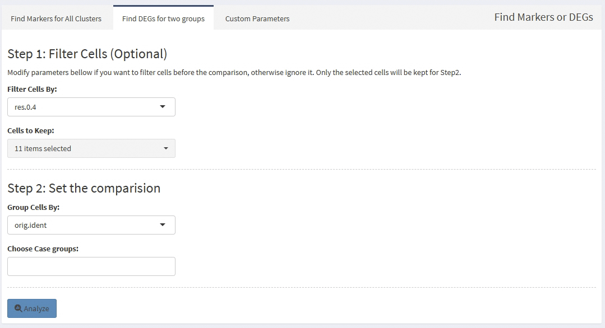

<!-- README.md is generated from README.Rmd. Please edit that file -->

# SeuratExplorer

<!-- badges: start -->

[](https://lifecycle.r-lib.org/articles/stages.html#experimental)
<!-- badges: end -->

## 为什么做这个R包

> 目前还没有很好的用于可视化Seurat分析结果的工具，当生物信息分析员将结果交给用户后，用户如果没有任何R语言基础，还是比较难去自行进行结果检索和再分析，这个R包可以帮助此类用户进行交互，实现分析结果的可视化，方便用户自行出图。用户仅需要在自己电脑上配置好R和Rstudio，然后安装运行此软件即可，无需其他操作。

> **本质上就是把R包`Seurat`里的部分绘图工具和差异分析工具进行可视化！**

> 此R包参考了开源程序:

> 1.  [Hla-Lab/SeuratExplorer](https://github.com/rwcrocker/SeuratExplorer/):
>     An interactive R shiny application for exploring scRNAseq data
>     processed in Seurat.

> 2.  [junjunlab/scRNAtoolVis](https://github.com/junjunlab/scRNAtoolVis):
>     Some useful function to make your scRNA-seq plot more beautiful.

## A Live Demo

Support Rds file size no more than 5GB.
[Open](http://www.nibs.ac.cn:666/SeuratExplorer/)

## Installation

You can install the development version of `SeuratExplorer` like so:

``` r
# install dependency
if (!require("BiocManager", quietly = TRUE))
    install.packages("BiocManager")
BiocManager::install("ComplexHeatmap")

# install SeuratExplorer
if(!require(devtools)){install.packages("devtools")}
install_github("fentouxungui/SeuratExplorer")
```

**建议将各个软件包升级到最新版本！否则可能出现兼容问题**

Run App:

``` r
library(SeuratExplorer)
launchSeuratExplorer()
```

## Functions

### Load data

- support data processed by Seurat V5 and older versions. it may takes a
  while for loading data.


### Cell Meta

- 支持下载cell meta信息，可用于统计特定分辨率下的细胞比例。


### Dimensional Reduction Plot

- 支持选择Dimension Reductions

- 支持选择不同的细胞分群方案

- 支持split

- 支持调整图像长宽比

- 支持是否显示cluster label

- 支持调整label大小

- 支持调整点的大小

- 支持pdf下载，所见即所得

Example plots:



### Feature Plot

- 支持输入多个基因名，以空格分割，基因名可不区分大小写。支持从excel拷贝多个基因！

- 支持选择Dimension Reductions

- 支持split

- 支持自定义最大和最小表达值对应的颜色

- 支持调整图像长宽比

- 支持调整点的大小

- 支持pdf下载，所见即所得


### Violin Plot

- 支持输入多个基因名，以空格分割，基因名可不区分大小写。支持从excel拷贝多个基因！

- 支持选择不同的细胞分群方案

- 支持split

- 支持stack和flip图像, 和指定颜色的映射

- 支持自定义最大和最小表达值对应的颜色

- 支持调整点的大小

- 支持调整x轴和y轴label的字体大小

- 支持调整图像长宽比

- 支持pdf下载，所见即所得


### Dot Plot

- 支持输入多个基因名，以空格分割，基因名可不区分大小写。支持从excel拷贝多个基因！

- 支持选择不同的细胞分群方案和指定所使用的clusters

- 支持split

- 支持对cluster/idents进行聚类

- 支持旋转坐标轴lable和旋转整个图像

- 支持调整点的大小和透明度

- 支持调整x轴和y轴label的字体大小

- 支持调整图像长宽比

- 支持pdf下载，所见即所得


### Heatmap Cell Level

- 支持输入多个基因名，以空格分割，基因名可不区分大小写。支持从excel拷贝多个基因！

- 支持选择不同的细胞分群方案

- 支持调整cluster label的大小、xy轴的位置和旋转角度

- 支持调整Group bar的高度

- 支持调整Group间的间隙大小

- 支持调整基因名的字体大小

- 支持调整图像长宽比

- 支持pdf下载，所见即所得


### Heatmap Group Averaged

- 支持输入多个基因名，以空格分割，基因名可不区分大小写。支持从excel拷贝多个基因！

- 支持选择不同的细胞分群方案

- 支持调整cluster label的大小、xy轴的位置和旋转角度

- 支持调整Group bar的高度

- 支持调整Group间的间隙大小

- 支持调整基因名的字体大小

- 支持调整图像长宽比

- 支持pdf下载，所见即所得


### Ridge Plot

- 支持输入多个基因名，以空格分割，基因名可不区分大小写。支持从excel拷贝多个基因！

- 支持选择不同的细胞分群方案

- 支持调整列的数目

- 支持Stack和指定颜色的映射

- 支持调整x轴和y轴label的字体大小

- 支持调整图像长宽比

- 支持pdf下载，所见即所得


### Plot Cell Percentage

- 支持调整图像长宽比

- 支持分面

- 支持pdf下载，所见即所得


### Cluster Markers and DEGs Analysis

- 支持同时计算所有群的marker基因

- 支持计算指定群之间的差异基因

- 支持先做subset，再计算指定群之间的差异基因

- 支持自定义部分计算参数

- 支持结果下载



### Top Expressed Features

> 首先逐个细胞计算得出每个细胞里的高表达基因\[即该基因的UMI比例大于所设定的阈值\]；
> 然后分群（celltype列）汇总高表达基因，得到每个高表达基因在每群里发生高表达的细胞数目，以及表达比例的均值和和中位值。

### Feature Summary

> 对于感兴趣的基因list分组做简要的统计分析，得到该基因在每群里的表达阳性比例，表达水平的均值和中位值

### Feature Correlation Analysis

- `Find Top Correlated Gene Pairs` 用于找出top 1000 correlated gene
  pairs

- `Find Correlated Genes for A Gene`
  用于找出对于感兴趣的某个基因，找出与其表达相关性强的基因

- `Calculate Correlation for A Gene List`
  用于对一组感兴趣的基因list，计算所有组合的表达相关性

- 如结果为空，或未找到对应的Gene
  Pairs，是由于输入基因的表达值太低，被去除了

- 支持分区计算correlation值

- 支持pearson和spearman算法


## Session Info

    #> R version 4.4.1 (2024-06-14 ucrt)
    #> Platform: x86_64-w64-mingw32/x64
    #> Running under: Windows 11 x64 (build 22631)
    #> 
    #> Matrix products: default
    #> 
    #> 
    #> locale:
    #> [1] LC_COLLATE=Chinese (Simplified)_China.utf8 
    #> [2] LC_CTYPE=Chinese (Simplified)_China.utf8   
    #> [3] LC_MONETARY=Chinese (Simplified)_China.utf8
    #> [4] LC_NUMERIC=C                               
    #> [5] LC_TIME=Chinese (Simplified)_China.utf8    
    #> 
    #> time zone: Asia/Shanghai
    #> tzcode source: internal
    #> 
    #> attached base packages:
    #> [1] stats     graphics  grDevices utils     datasets  methods   base     
    #> 
    #> loaded via a namespace (and not attached):
    #>  [1] compiler_4.4.1    fastmap_1.2.0     cli_3.6.3         tools_4.4.1      
    #>  [5] htmltools_0.5.8.1 rstudioapi_0.16.0 yaml_2.3.8        rmarkdown_2.27   
    #>  [9] highr_0.11        knitr_1.47        xfun_0.45         digest_0.6.36    
    #> [13] rlang_1.1.4       evaluate_0.24.0
